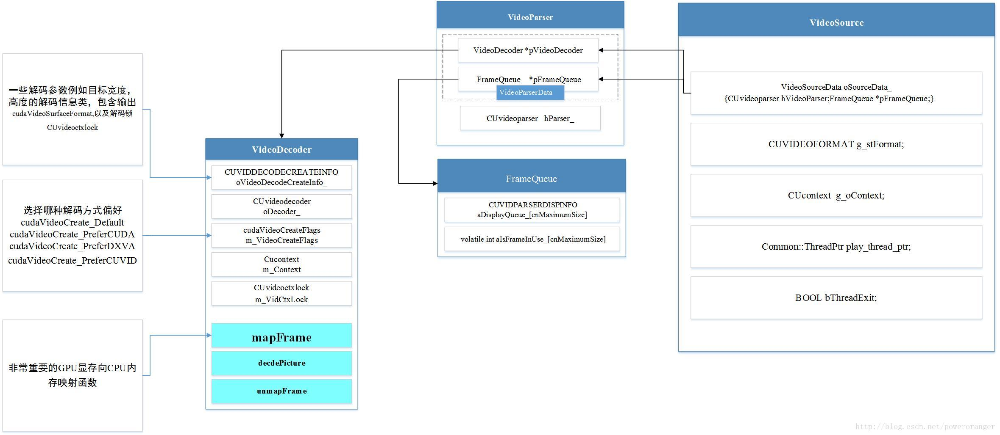

# FFmpeg-CUDA
**最近领导布置一个用CUDA解码USB摄像头的任务，小白从头学习...**    
**实现流程： v4l2 -- ffmpeg -- opencv**    
**待更新...**      

-----
### Introduction
* Ubuntu16.04
* 需要编译opencv库和ffmpeg库 （/Docs里有ffmpeg库的安装说明）    
* opencv 3.4.0
* ffmpeg 4.1.3

### How to Use
#### **1、2019/5/13 Code/ff_camera.cpp**    

采用ffmpeg的CPU解码，并用opencv显示
```
cd Code
make 
./camera
```

#### **2、CUDA解码**
CUDA解码的核心为三个类    
**VideoSource**，**VideoParser**，**VideoDecoder**     
其框架关系贴一张 [博客](https://blog.csdn.net/poweroranger/article/details/77845238)上的图


------
### Reference 
#### **入门**
* 首推雷神的各种资料
* **https://blog.csdn.net/leixiaohua1020/article/details/39702113**
* **https://blog.csdn.net/ice__snow/article/details/78608681**
* **https://blog.csdn.net/iamqianrenzhan/article/details/84830277**
* https://blog.csdn.net/zong596568821xp/article/details/80280390
* https://blog.csdn.net/scarecrow_wiscom/article/details/10614145#
* https://blog.csdn.net/teleger/article/details/80716947
* https://www.jianshu.com/p/6ef3c18d61b0

#### **CUDA**
* 关于硬编解码资料不多，还是看源码吧
* https://developer.nvidia.com/nvidia-video-codec-sdk
* https://www.cnblogs.com/betterwgo/p/6613641.html
* https://blog.csdn.net/huangyifei_1111/article/details/86086486
* https://blog.csdn.net/poweroranger/article/details/77845238
* https://blog.csdn.net/xiaoyafang123/article/details/79863178
